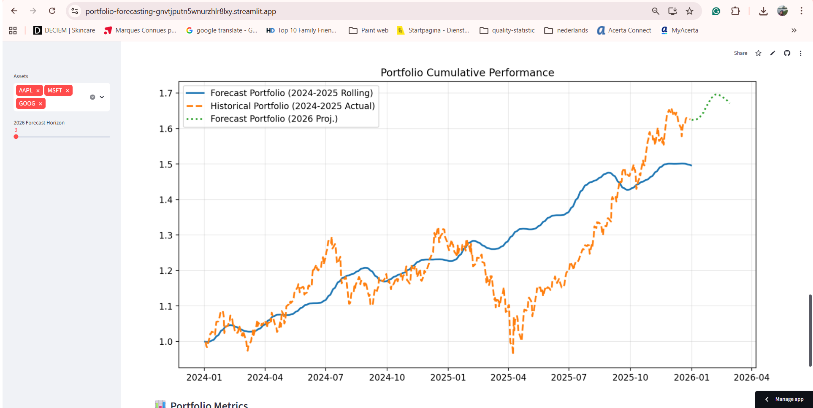

# 📈 AI Portfolio Optimizer – Prophet

⏱️Project Timeline
   Duration: 4 Days

## 🌟 Quick Overview (STAR Method)

**Situation:** Financial markets require both precise price prediction and robust risk management strategies.  

**Task:** Develop a dual-track project to evaluate multiple forecasting models and apply them to real-world portfolio optimization.  

**Action:** Benchmarked ARIMA, Prophet, and XGBoost for price forecasting. Implemented a rolling Prophet model within a Streamlit dashboard to optimize Sharpe-ratio-based portfolios.  

**Result:** Identified XGBoost as the leader for raw price accuracy, while Prophet provided the most stable return distributions for portfolio allocation.  

---

## 📂 Project Structure

```text
portfolio-forecasting/
├── price_prediction_models/    # PART A: Raw Price Forecasting Research
│   ├── arimastockprice.ipynb   # ARIMA Experimentation
│   ├── prophetstockprice.ipynb # Prophet Experimentation
│   └── xgbooststockprice.ipynb # XGBoost Experimentation (Best Price Accuracy)
├── portfolio_forecasting/      # PART B: Portfolio Optimization Apps
│   ├── prophetfinal.py         # Main Streamlit App (Prophet Implementation)
│   └── arimafinal.py           # Alternative Streamlit App (ARIMA Implementation)
├── data/                       # Dataset Storage
│   └── stockdate.csv           # Historical Stock Price Data
├── requirements.txt            # Project Dependencies
└── README.md                   # Documentation


---

## 💡 Key Insights

- **Dual-Track Evaluation:** Best model for point-in-time price prediction (XGBoost) may differ from the best model for capturing return distributions for optimization (Prophet).  
- **Rolling Forecast (2024-2025):** Retrains every month, simulating a professional environment with updated strategies.  
- **Diversification Guardrails:** Asset weights capped between 1% and 40% to prevent concentration risk.  
- **Risk Management:** Focus on Sortino Ratio and Max Drawdown to measure downside protection.

---

## 🧠 How It Works

### 1️⃣ Part A: Price Forecasting Models (`/price_prediction_models`)

- **ARIMA:** Traditional statistical baseline for time-series.  
- **Prophet:** Specialist in handling seasonality and market changepoints.  
- **XGBoost:** Winner for Price Accuracy — lowest RMSE/MAPE for direct price forecasting.

### 2️⃣ Part B: Forecasting for Portfolio Optimization (`/portfolio_forecasting`)

- **Prophet:** Winner for Optimization — provides stable return distributions for Mean-Variance Optimization.  
- **ARIMA (Final):** Alternative implementation for benchmarking.  
- **2026 Projection:** Long-term projection from the end of 2025 using the last known market prices.

### 3️⃣ Portfolio Optimization Engine

- **Historical-based:** Optimal allocation using 2016–2023 data.  
- **Forecast-based:** AI-predicted allocation for the future.  
- **Realized:** Benchmarking against actual 2024–2025 market performance.

---

## 📌 Features

- ✅ Interactive Dashboards: Dynamic ticker selection & forecast horizon sliders.  
- ✅ Comparative Frontiers: Visual Efficient Frontier analysis across time windows.  
- ✅ Accuracy Tracking: Live RMSE & MAPE metrics for forecast validation.  
- ✅ Live Apps: Accessible via Streamlit Cloud for real-time interaction.

---

## 📦 Installation & Run

```bash
# Clone the repository
git clone https://github.com/esramogulkoc-dev/portfolio-forecasting
cd portfolio-forecasting

# Install dependencies
pip install -r requirements.txt

# Run the Prophet Optimizer (Main App)
streamlit run prophetfinal.py

# Run the ARIMA Optimizer (Alternative)
streamlit run arimafinal.py

---

## 🚀 Live Demo

You can access the live interactive dashboard here:  
🔗 **[AI Portfolio Optimizer - Live on Streamlit Cloud](https://portfolio-forecasting-gnvtjputn5wnurzhlr8lxy.streamlit.app/)**



*Note: The app includes a hybrid data engine. If Yahoo Finance rate limits are triggered on the cloud server, it automatically fails over to the local `stockdate.csv` to ensure 100% uptime.*


